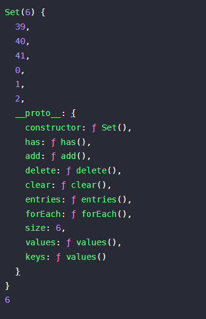

# 1차원 배열

|no|문제|풀이|
|---|----|----|
|1|[최소, 최대](https://www.acmicpc.net/problem/10818)|[10818.js](src/10818.js)|
|2|[최댓값](https://www.acmicpc.net/problem/2562)|[2562.js](src/2562.js)|
|3|[숫자의 개수](https://www.acmicpc.net/problem/2577)|[2577.js](src/2577.js)|
|4|[나머지](https://www.acmicpc.net/problem/3562)|[3562.js](src/3562.js)|
|5|[평균]](https://www.acmicpc.net/problem/1546)|[1546.js](src/1546.js)|
|6|[OX퀴즈](https://www.acmicpc.net/problem/8958)|[8958.js](src/8958.js)|
|7|[평균은 넘겠지](https://www.acmicpc.net/problem/4344)|[4344.js](src/4344.js)|


## 새롭게 알게 된 것
### js의 Array
Array 선언
```javascript
// 배열 기본 선언
var arr = []  // []
var arr = new Array()  // []

// 배열 값 넣어 초기화
var arr = [1,2,3,4,5]  // [1,2,3,4,5]
var arr = new Array(5)  // [undifined, undifined, undifined, undifined, undifined]
var arr = new Array(1,2,3,4,5)  // [1,2,3,4,5]
var arr = new Array(5).fill(1,2,3,4,5)  // [1,2,3,4,5]

// 배열 0으로 초기화
var arr = new Array(5).fill(0) // [0,0,0,0,0]
```
- [참고블로그 - 자바스크립트 배열 기본 사용법](https://nobacking.tistory.com/29)
- [참고블로그 - 자바스크립트 배열값 0으로 초기화](https://miiingo.tistory.com/323)

### js의 Set
Set 선언
```javascript
// 배열 기본 선언
var mySet = {} // {}
var mySet = new Set()  // {}
```

Set 객체 사용
```javascript
// 요소 추가
mySet.add(1)  // {1}
mySet.add('hi')  // {1, 'hi'}
mySet.add(1)  // {1, 'hi'}

// 요소 확인
mySet.has(1)  // true
mySet.has(2)  // false

// 요소 제거
mySet.delete('hi') // {1}

// 모든 요소 제거
mySet.clear()  // {}

// 요소 개수 반환
mySet.size // {1,2,'hi'} => 3
```
- [참고블로그](https://miiingo.tistory.com/323)

### js list 마지막 -> 더 알아보기
